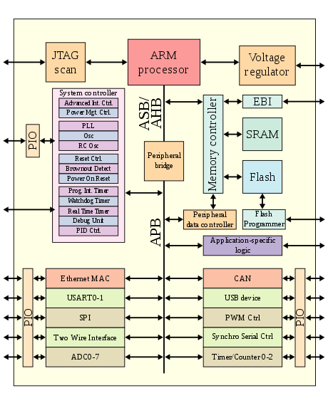
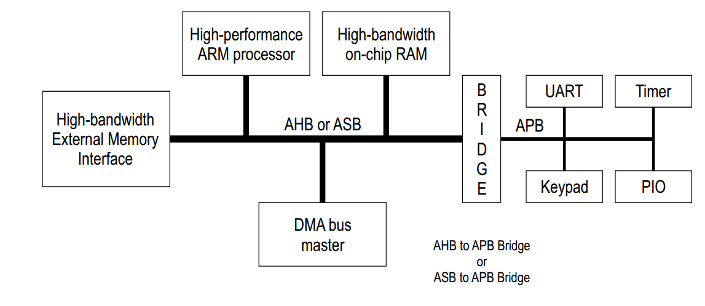
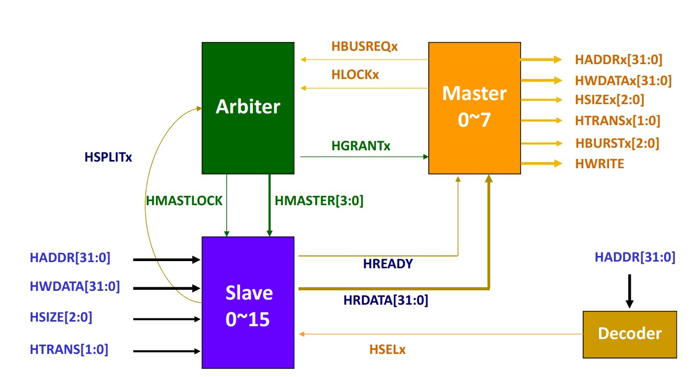
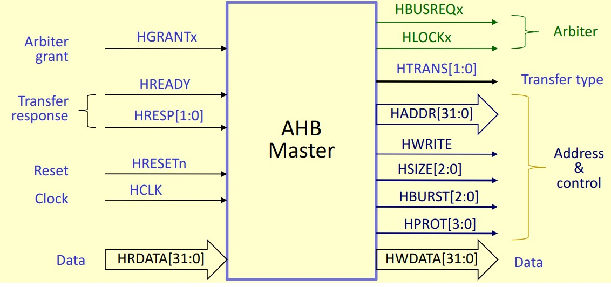
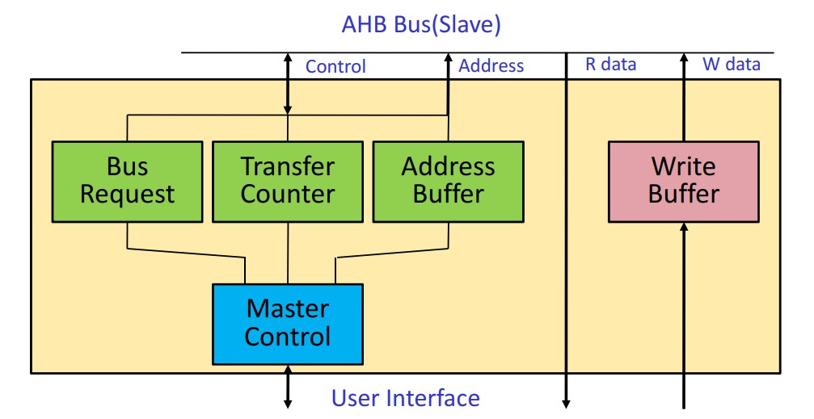
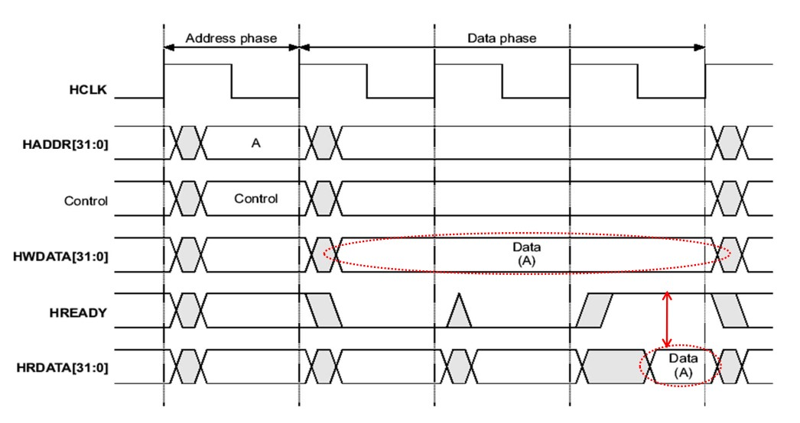
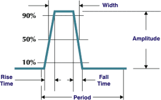
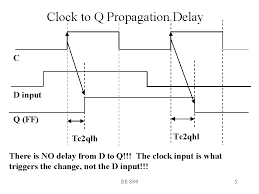

<!-- omit in toc -->
# ARM Architecture
<!-- omit in toc -->
## <a name="toc"></a> Table of Contents
- [ARM Overview](#arm-overview)
- [AMBA Overview](#amba-overview)  
   - [Why Do We Need On-Die Interconnect?](#why-on-die-interconnect)  
   - [AMBA AHB](#amba-ahb) 
     - [AMBA AHB Signal List](#amba-ahb-signals)
     - [AMBA AHB Master](#amba-ahb-master)
     - [AMBA AHB Slave](#amba-ahb-slave)
   
-  [Performance Metrics and Timing Concepts in Circuits](#perf_metrics)
   
<br/>

<!-- omit in toc -->
## <a name="arm-overview"></a> ARM Overview  [<sub><sup>Back to Table of Contents</sup></sub>](#toc)
---
<p align="center">
  
  <br>
    <a href="https://en.wikipedia.org/wiki/ARM_architecture_family">ARM Architecture Family Wikipedia</a>
</p>  
<br/>  

ARM architecture is a widely used and highly popular architecture for designing efficient and power-effective processors. It offers a range of processors suitable for various applications, from small embedded devices to high-performance computing systems. At a high level, ARM processors are based on a load-store architecture, where data processing occurs between registers and memory. They employ a pipeline structure that enables concurrent execution of multiple instructions, resulting in improved performance.

ARM architecture is characterized by its emphasis on low power consumption, scalability, and versatility. It provides a wide range of processor cores, such as ARM Cortex-A, Cortex-R, and Cortex-M, each optimized for specific application domains. The architecture supports various features, including instruction sets, memory management units, and co-processor interfaces, to cater to different requirements. ARM processors also leverage advanced techniques like branch prediction, caching, and out-of-order execution to enhance performance. Additionally, ARM's architectural licensing model allows for customization and integration of ARM processors into diverse system-on-chip (SoC) designs, enabling efficient and tailored solutions for specific applications.

Overall, the ARM architecture stands as a dominant force in the semiconductor industry, powering a vast array of devices and systems. Its blend of performance, power efficiency, scalability, and flexibility has made it a go-to choice for designers seeking high-performance computing solutions with low power consumption and adaptable architecture.


<br/><br/>


<!-- omit in toc -->
## <a name="amba-overview"></a> AMBA Overview [<sub><sup>Back to Table of Contents</sup></sub>](#toc)
---
The Advanced Microcontroller Bus Architecture (AMBA) is a fundamental component in System-on-Chip (SoC) designs. Created by ARM Ltd., AMBA serves as a communication bridge between various elements within an SoC, including processors, memory controllers, and peripheral devices. It offers a standardized approach for high-capacity data transfer, enhancing the efficiency, flexibility, and scalability of modern, high-performance devices. With its widespread adoption, AMBA has become the industry standard, streamlining the design process and propelling high-speed computing applications.

<p align="center">
  
  <br>
    <a href="https://www.allaboutcircuits.com/technical-articles/introduction-to-the-advanced-microcontroller-bus-architecture/">AMBA Architecture</a>
</p>

<br/><br/>

<!-- omit in toc -->
### <a name="why-on-die-interconnect"></a> Why Do We Need On-Die Interconnect? [<sub><sup>Back to Table of Contents</sup></sub>](#toc)

<p align="center">
  
  <br>
    <a href="https://www.chipestimate.com/Multicore-ARM-SoCs-Face-Cache-Coherency-Dilemma/Cadence/Technical-Article/2012/10/02">ARM Interconnect Example</a>
</p>

The on-die interconnect is a central element in the structure and functioning of a microprocessor or a System-on-Chip (SoC). Consider it the high-speed transportation system within the dense cityscape of a chip. It interlinks all the critical parts of the city - the CPU, memory, cache, and peripherals, ensuring smooth and rapid transit of data across the entire metropolitan area (the chip).

Imagine the interconnect as the highway system within a city, connecting different parts of the city, like the CPU, memory, cache, and peripherals. If the highway is within the city (on-die), travel between different parts becomes quicker and more efficient - there's no need to travel long distances between different cities (off-chip), which takes more time and energy.

The reason for this enhanced efficiency is that data doesn't need to leave the chip to move between different components. This cuts down on delays, boosting overall performance. Plus, it reduces energy consumption, crucial for devices like smartphones where battery life is key.

Now, onto coherent and non-coherent interconnects. Think of a coherent interconnect as a shared document, where everyone can see and respond to the latest changes others have made. This type of 'seeing the latest changes' is essential when different cores of a processor need to work together, sharing data seamlessly.

Non-coherent interconnects, on the other hand, are like everyone working on their own document - they don't need to see or respond to others' changes. This works best for components that operate independently, without needing shared data access.

In essence, on-die interconnects are fundamental to making a microprocessor or SoC efficient and fast. They provide the vital infrastructure needed for data communication and sharing, enhancing the functionality of the entire system, whether data needs to be shared (coherent) or not (non-coherent).
<br/><br/>


### <a name="bus-overview"></a> BUS Overview [<sub><sup>Back to Table of Contents</sup></sub>](#toc)
--- 
<p align="center">
  
  <br>
    <a href="http://contents.kocw.net/KOCW/document/2014/sungkyunkwan/hantaehee/4.pdf">Bus Master and Slave</a>
</p>
  
What is a bus? In computer architecture, a bus is a communication system that transfers data between different components inside a computer, or between different computers. The term comes from the Latin word "omnibus", which means "for all", and it accurately captures the function of a bus: a shared communication link used by many different devices.  
<br/>
A bus transactions consists of two parts:  

- Issuing the command (and address): request  
- Transfering the data: action  
  
<br/>
In the context of AMBA (Advanced Microcontroller Bus Architecture) or generally in digital electronics, the terms "master" and "slave" are used to define the roles of bus participants.

1. Master: A master is a device that initiates transactions on the bus. It generates the clock and control signals to dictate the data flow. In AMBA, a master could be a processor or a Direct Memory Access (DMA) controller that initiates read or write operations. In other words, master is the one that issues the commands (and address).

2. Slave: A slave is a device that responds to the transactions initiated by the master. It receives the control signals and responds to the data flow accordingly. In AMBA, slaves are typically peripheral devices such as memory modules, input/output interfaces, or other functional units. They wait for the master's commands to perform read or write operations. This means that slave is the one who responds to the address by sending the data to the master if the master ask for data or receiving data from the master if the master wants to send the data.

The master-slave communication model allows for precise control of data transfer, ensuring that only one device (the master) has the authority to control the data flow at any given time. This model is central to the operation of AMBA and other bus protocols. It's worth noting that the terminology is changing in the industry, with "initiator" and "target" or "requester" and "responder" being used instead of "master" and "slave", respectively.


#### Example of the bus transactions
**Sending data from the CPU to the USB device:**

1. The CPU (master) writes data to a specific location in its memory space that corresponds to a register or buffer in the USB controller (slave). This write operation is a command issued over the AMBA bus.
2. The AMBA bus protocol ensures this command is carried out effectively by managing the necessary handshaking, addressing, and data transfer.
3. Once the data is written to the USB controller's register or buffer, the USB controller takes over. It transmits this data to the connected USB device over the USB interface.

**Receiving data from the USB device to the CPU:**

1. When a USB device sends data (for example, a keyboard sending a keystroke), the USB controller first receives this data over the USB interface.
2. The USB controller writes this data to a specific buffer or register and then triggers an interrupt signal to the CPU.
3. In response to the interrupt signal, the CPU issues a read command over the AMBA bus to fetch the data from the USB controller's buffer.
4. Once again, the AMBA bus protocol handles the addressing, data transfer, and error detection during this operation.

This way, AMBA bus enables efficient communication between the CPU and the USB controller, which is crucial for an ARM SoC's functioning.

<br/><br/>  

<!-- omit in toc -->
## <a name="amba-ahb"></a> AMBA AHB [<sub><sup>Back to Table of Contents</sup></sub>](#toc)  
---  
<p align="center">
  
  <br>
    <a href="http://contents.kocw.net/KOCW/document/2014/sungkyunkwan/hantaehee/4.pdf">AMBA AHB Architecture</a>
</p>
<br/>  
The Advanced High-performance Bus (AHB) is a part of ARM's Advanced Microcontroller Bus Architecture (AMBA). AHB is designed for high-performance system modules and is used in high-speed systems.

AHB's primary role is to connect high bandwidth components such as CPUs, DSPs, and memory elements to the system bus. By doing so, AHB acts as a high-performance system backbone bus, supporting efficient communication between these components.

The bus architecture of AHB is designed for low-power peripheral macro cell functions, connecting processors, on-chip memories, and off-chip external memory interfaces. It uses a non-multiplexed protocol, meaning it has separate buses for address and data, which improves the speed of data transfer.

In an AHB system, devices are designated as masters or slaves, similar to other bus architectures. Masters initiate data transfers, while slaves respond to them. AHB can support multiple masters and includes an arbitration scheme to determine which master gains control of the bus.

Furthermore, AHB employs pipelining and supports burst transfers, enabling it to start a new transfer before the previous one concludes and transfer a block of data at once, respectively. Both of these features significantly enhance data transfer efficiency.

**Arbiter**
- **Bus Control:** Controls which master has access to the bus when multiple masters request access simultaneously.
- **Arbitration Scheme:** Determines the next master to get the bus grant based on the implemented arbitration scheme (fixed priority, round-robin, etc.).
- **Handshake:** Completes the handshake with the requesting master by asserting the HGRANT signal.

**Master**
- **Address Generation:** Generates the addresses for read or write operations.
- **Transfer Type Selection:** Specifies the type of transfer (read or write).
- **Data Transfer:** Provides data for write operations and retrieves data for read operations.
- **Burst Information:** Sets the length of bursts for burst transfers.
- **Bus Request:** Requests access to the bus by asserting the HBUSREQ signal.
- **Lock Transactions:** Asserts the HLOCK signal when it needs to lock the bus for multiple transactions.
- **Error Handling:** Handles error conditions signaled by the slave through the HRESP signal.

**Slave**
- **Data Provision:** Provides data to the master during a read operation.
- **Data Reception:** Receives data from the master during a write operation.
- **Response Generation:** Generates a response (OKAY, ERROR) for each transfer.
- **Decode Address:** Decodes the address to check if the transaction is targeted to it.
- **Supports Burst Transfers:** It needs to support single and incrementing burst types.

**Decoder**
- **Address Decode:** Decodes the address lines to select the corresponding slave.
- **Slave Selection:** Asserts the select line of the corresponding slave when a valid address is placed by the master.
- **Support for Split Transactions:** If the architecture supports split transactions, the decoder is also responsible for handling the retry and split responses.

<br/><br/>

<!-- omit in toc -->
## <a name="amba-ahb-signals"></a> AMBA AHB Signal List [<sub><sup>Back to Table of Contents</sup></sub>](#toc)    


| Signal Name  | Source | Description |
| ------------ | ------ | ----------- |
| HCLK         | Master | Clock signal, provided by the master. |
| HRESETn      | Master | Active low reset signal, set by the master to reset the slave. |
| HADDR[31:0]  | Master | 32-bit address bus, set by the master to specify the target address for the transaction. |
| HRDATA[31:0] | Slave  | 32-bit read data bus, data presented by the slave for read transactions. |
| HWDATA[31:0] | Master | 32-bit write data bus, data presented by the master for write transactions. |
| HWRITE       | Master | Transfer direction signal, set by the master. Read=0, Write=1. |
| HBURST[2:0]  | Master | 3-bit Burst size indicator, set by the master. Represents burst length from 1 to 8 (0x0=1, 0x1=2, ..., 0x7=8). |
| HPROT[3:0]   | Master | 4-bit Protection control signal, set by the master. Indicates the type of protection required for the transfer. |
| HTRANS[1:0]  | Master | 2-bit Transfer type signal, set by the master. (IDLE=0b00, BUSY=0b01, NONSEQ=0b10, SEQ=0b11) |
| HMASTLOCK    | Master | Lock signal for exclusive access, set by the master. |
| HREADY       | Slave  | Slave ready signal, set by the slave to indicate it's ready for next data transfer. |
| HRESP        | Slave  | Response from slave, set by the slave to indicate the status of the transaction (OKAY=0, ERROR=1). |
| HSIZE[2:0]   | Master | 3-bit Size of bus transfer signal, set by the master. Indicates the width of the data bus used for the transaction. |
| HBUSREQ      | Master | Bus request signal, set by the master to request bus ownership. |
| HGRANT       | Slave  | Bus grant signal, set by the arbiter (usually integrated into the slave) in response to the HBUSREQ. |
| HLOCK        | Master | Lock signal, set by the master to lock the bus for multiple transfers. |
| HSEL         | Slave  | Select signal for slave, set by the arbiter to indicate the target slave for the current transfer. |
| HSPLIT[3:0]  | Slave  | 4-bit Split transaction response, set by the slave to request the master to end current transaction and start a new one. |
| HMASTER[3:0] | Slave  | 4-bit Master ID, set by the arbiter to indicate the ID of the current master. |

<br/><br/>
### <a name="amba-ahb-master"></a> AMBA AHB Master [<sub><sup>Back to Table of Contents</sup></sub>](#toc)    
 
<p align="center">
  
  <br>
    <a href="http://contents.kocw.net/KOCW/document/2014/sungkyunkwan/hantaehee/4.pdf">AMBA AHB Master</a>
</p>
<br/>
  
The AMBA AHB Master serves as the initiator of transactions on the AMBA AHB bus. It generates the control signals, issues commands, and handles the transfer of data over the bus. Key responsibilities of the AHB master include:

- **Initiating read or write operations:** The AHB master sets up the command, address, and control signals required for a transaction. 

- **Managing data transfers:** Depending on the operation, the master either sends data (write operation) to a slave or receives data (read operation) from a slave.

- **Handshake protocol:** The master handles the necessary handshaking signals (such as HREADY and HRESP) to ensure successful completion of transactions.

Examples of AHB master components in an SoC can include a CPU, a DMA (Direct Memory Access) controller, or any other peripheral that needs to initiate data transfers on the bus. Each of these components can act as an AHB master when they need to read or write data over the bus. The exact implementation of the master can vary based on the specific requirements of these components.

 <br/>
<p align="center">
  
  <br>
    <a href="http://contents.kocw.net/KOCW/document/2014/sungkyunkwan/hantaehee/4.pdf">AMBA AHB Master Interface</a>
</p>
<br/>  

**Master Control**
- Manages the overall operation of the AHB master interface.
- Responsible for initiating bus requests and releasing them when no more transfers are required.

**Bus Request**
- When the master requires the bus, it asserts a bus request signal to the arbiter.
- The master must continue to assert the bus request until it receives a bus grant signal from the arbiter.

**Transfer Control**
- Manages all aspects of data transfer, such as setting up, executing, and completing data transfers.
- Takes care of differentiating between single transfers, incremental bursts, or wrap-around bursts.

**Address Buffer**
- A queue that temporarily holds the addresses to be used for read/write operations.
- Allows the master to continue to perform operations while waiting for the arbiter to grant the bus.

**Write Buffer**
- A queue that temporarily holds the data to be written to a slave.
- Provides time for the master to set up for data write operations while waiting for the bus grant.
  
<br/><br/>

### <a name="amba-ahb-slave"></a> AMBA AHB Slave [<sub><sup>Back to Table of Contents</sup></sub>](#toc)    
<p align="center">
  
  <br>
    <a href="http://contents.kocw.net/KOCW/document/2014/sungkyunkwan/hantaehee/4.pdf">AMBA AHB Slave</a>
</p>
<br/>  

The AMBA AHB Slave responds to transactions initiated by the AHB master on the AMBA AHB bus. The slave receives the control signals, responds to the commands, and manages the transfer of data over the bus. Key responsibilities of the AHB slave include:

- **Responding to read or write operations:** The slave receives the command, address, and control signals from the master. Depending on the operation, it either sends data (read operation) to the master or receives data (write operation) from the master.

- **Managing data transfers:** The slave is responsible for holding the data being read by the master or storing the data being written by the master.

- **Handshake protocol:** The slave responds to the handshaking signals from the master (such as HREADY and HRESP) to ensure successful completion of transactions.

Examples of AHB slave components in an SoC can include memory modules like RAM or ROM, input/output interfaces, or any other peripheral that needs to respond to data transfers on the bus. Each of these components can act as an AHB slave when the master reads from or writes to them. The exact implementation of the slave can vary based on the specific requirements of these components.

 
<br/><br/>


<!-- omit in toc -->
### <a name="amba-ahb-basic-transfer"></a> AMBA AHB Basic Transfer [<sub><sup>Back to Table of Contents</sup></sub>](#toc)   
<p align="center">
  
  <br>
    <a href="http://contents.kocw.net/KOCW/document/2014/sungkyunkwan/hantaehee/4.pdf">AMBA AHB Basic Transfer</a>
</p>
<br/>  
In AMBA AHB (Advanced Microcontroller Bus Architecture Advanced High-performance Bus), the communication or data transfer process can be divided into two main phases: the address phase and the data phase.
  
<br/>  

1. **Address Phase**
   - This is the initial phase of any data transfer where the master places the address and control signals on the bus.
   - Address signal `HADDR`, control signal `HTRANS`, and write data signal `HWDATA` (for write operations) are asserted.
   - Only one address phase occurs at a time, always followed by a data phase.

2. **Data Phase**
   - This phase occurs after the address phase and is where the actual data transfer happens.
   - During a read operation, the slave places the requested data on `HRDATA`.
   - During a write operation, the master places the write data on `HWDATA`.
   - A single address phase can be followed by multiple data phases during a burst transfer.

These two phases together make a complete transaction on the bus. AMBA AHB supports various data transfer types such as single transfers (one address phase, one data phase) and burst transfers (one address phase, multiple data phases).  
<br/>
In the figure above:

- The `HWDATA` line represents the data being sent from the master to the slave. The specific data is placed on the `HWDATA` bus when the transfer begins.

- Concurrently, the `HWRITE` line (a part of the control signals) indicates the type of operation. If `HWRITE` is HIGH, it's a write operation from the master to the slave. If `HWRITE` is LOW, it's a read operation from the slave to the master.

- During a **write operation**, the slave consumes the data from the `HWDATA` bus once the `HREADY` signal is asserted by the slave. The `HREADY` signal being set to '1' indicates that the slave has completed processing the current transfer and is ready for the next one. If the slave were a slower component and needed more time to process the transfer, it would set `HREADY` to '0', effectively stalling the bus until it was ready to handle the next transfer.

- During a **read operation**, the slave puts the requested data onto the `HRDATA` line following the assertion of `HREADY`. This represents data being sent from the slave back to the master.

This sequence of events illustrates the flow of data transfers on the AHB bus, where the type of operation (read or write) is dictated by the `HWRITE` signal and the pace of transfer is controlled by the `HREADY` signal.


<br/><br/>
<!-- omit in toc -->
## <a name="perf_metrics"></a> Performance Metrics and Timing Concepts in Circuits [<sub><sup>Back to Table of Contents</sup></sub>](#toc)
--- 
### Circuit Latency (L)
What is circuit latency? Latency is the time between the arrival of new input and generation of corresponding output.

For combinational circuits this is just TPD (Total Propagation Delay).

Example to calculate TPD
```
  A ----\
         \
          AND ----\
         /         \
  B ----/           OR --- D
                   /
  C --------------/     

```
Assumption:
- A, B, and C are available at time t = 0.
- The AND gate has a latency of 5 ns.
- The OR gate has a latency of 7 ns.  
<br/>

1. The signal at the output of the AND gate is ready at t = 0 (time when A and B are available) + 5 ns (AND gate latency) = 5 ns.
2. The signal at the output of the OR gate, which is the final output D, is ready at the maximum between t = 5 ns (when the output of the AND gate is ready) and t = 0 (time when C is available). Hence, D is ready at t = max(5 ns, 0 ns) + 7 ns (OR gate latency) = 12 ns.

Hence,  
TPD for D = 5ns + 7ns = 12ns
<br/><br/>

### Circuit Throughput (T)
The rate at which a circuit can process or produce operations, typically measured as the inverse of the circuit's propagation delay or latency. It is quantified as 1/TPD or 1/L, where TPD is the propagation delay and L is the latency.

- Propagation Delay (TPD): This is the time it takes for a signal to travel from the input to the output of a device. It is a key measure of the speed of a logic gate or circuit. It is concerned with the delay encountered by a single signal pulse.

- Latency (L): This refers to the total time it takes for a signal to travel from one point in a system to another. In a complex digital system, this would involve multiple stages and components, and hence latency is typically larger than the propagation delay of a single component. Latency can also refer to the delay before a transfer of data begins following an instruction for its transfer.

In summary, TPD refers to the delay of a single component or gate, while latency refers to the total delay from one end of a system to the other. In terms of calculating throughput, using TPD will refer to the maximum rate a single operation can be completed, while using L will give the rate at which a complete set of operations, or sequence of operations, can be completed.


Using the same example from section above. The throughput can be calcuated as follow:
```
Throughput = 1 / TPD  
           = 1 / 12 ns  
           = approximately 83.33 MHz (Mega "operations" per second)
```


<br/><br/>  

### Important Time Concepts
#### Setup Time and Hold Time
- Setup Time: The interval before the clock edge during which data must be stable. The data input should not change in this period for correct operation.
- Hold Time: The interval after the clock edge during which data must remain stable. The data should not change in this period for correct operation.

- Setup Time Violation: This occurs when the data changes too close to the clock edge and does not respect the setup time. In other words, the data isn't stable long enough before the clock edge arrives. This may result in incorrect data being latched.

- Hold Time Violation: This occurs when the data changes too soon after the clock edge, not respecting the hold time. In other words, the data doesn't remain stable for long enough after the clock edge. This may result in incorrect data being latched.

<p align="center">
  
  <br>
    <a href="https://electronics.stackexchange.com/questions/347499/setup-and-hold-time-output-when-violated"> Setup Time and Hold Time</a>
</p>

<br/><br/>


#### Rise Time and Fall Time
- Rise Time: The rise time of a digital signal is the time required for the signal to change from a specified low value (usually 10% of the final value) to a specified high value (usually 90% of the final value). In other words, it's the time taken for a signal to change from a '0' (low) to a '1' (high).

- Fall Time: The fall time is exactly the opposite of the rise time. It is the time required for the signal to fall from a specified high value (usually 90% of the initial value) to a specified low value (usually 10% of the initial value). Essentially, it's the time taken for a signal to change from a '1' (high) to a '0' (low).

These timings are particularly important in high-speed digital circuits, as they can affect the proper functioning of the circuit. If a signal changes state too quickly, it may cause noise and other problems. Conversely, if it changes too slowly, it can cause timing problems. Therefore, designers often aim to control and optimize the rise and fall times to ensure reliable circuit operation.

<p align="center">
  
  <br>
    <a href="http://www.vlsijunction.com/2015/12/fall-time.html"> Rise Time and Fall Time</a>
</p>

<br/><br/>

#### Clock-to-Q delay (tCQ)

The Clock-to-Q delay (tCQ) is an important timing parameter in digital circuits, specifically with flip-flops and latches.

tCQ represents the time taken for the output of a flip-flop or latch to respond to a change in the clock signal.

In other words, when the clock edge (either rising or falling depending on the type of flip-flop) occurs, the input data will take some finite amount of time to propagate to the output. This delay is referred to as the Clock-to-Q delay (tCQ).

Designers must account for tCQ in the overall timing analysis to ensure that the next stage in a circuit will have valid data present at its input when its clock signal arrives. If tCQ is too long, it can lead to setup time violation and possibly incorrect behavior of the digital system.

<p align="center">
  
  <br>
    <a href="http://www.pldworld.info/_hdl/2/RESOURCES/www.ece.msstate.edu/_reese/EE3714/fftiming/sld005.htm"> Clock to Q Propagation Delay</a>
</p>


<br/><br/>  

## Verilog Training
1. [HDLbits](https://hdlbits.01xz.net) 
2. [chipdev.io](https://chipdev.io/)

<br/><br/>

## References [<sub><sup>Back to Table of Contents</sup></sub>](#toc)
1. [SoC Achitecture: ARM/ AMBA by Tae Hee Han, Sungyunkwan University](./resources/soc_archirecture_arm_and_amba.pdf),  Original URL: http://contents.kocw.net/KOCW/document/2014/sungkyunkwan/hantaehee/4.pdf
2. [Understanding AMBA Bus Architechture and Protocols](https://anysilicon.com/understanding-amba-bus-architecture-protocols/)
3. [AMBA - Advanced Microcontroller Bus Architecture](https://www.youtube.com/watch?v=CbdjCKdVsG0)
4. [MIT: Pipelining & Verilog](./resources/mit_pipelining_and_verilog.pdf), Original URL: http://web.mit.edu/6.111/www/f2016/handouts/L09.pdf