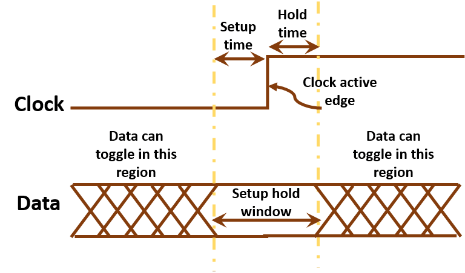

<!-- omit in toc -->
# ARM Architecture
<!-- omit in toc -->
## Table of Contents
1. [ARM Overview](#arm-overview)
2. [AMBA Overview](#amba-overview)
3. [Why Do We Need On-Die Interconnect?](#why-on-die-interconnect)
4. [Performance Metrics](#perf_metrics)
   
<br/>

<!-- omit in toc -->
## <a name="arm-overview"></a> ARM Overview
ARM architecture is a widely used and highly popular architecture for designing efficient and power-effective processors. It offers a range of processors suitable for various applications, from small embedded devices to high-performance computing systems. At a high level, ARM processors are based on a load-store architecture, where data processing occurs between registers and memory. They employ a pipeline structure that enables concurrent execution of multiple instructions, resulting in improved performance.

ARM architecture is characterized by its emphasis on low power consumption, scalability, and versatility. It provides a wide range of processor cores, such as ARM Cortex-A, Cortex-R, and Cortex-M, each optimized for specific application domains. The architecture supports various features, including instruction sets, memory management units, and co-processor interfaces, to cater to different requirements. ARM processors also leverage advanced techniques like branch prediction, caching, and out-of-order execution to enhance performance. Additionally, ARM's architectural licensing model allows for customization and integration of ARM processors into diverse system-on-chip (SoC) designs, enabling efficient and tailored solutions for specific applications.

Overall, the ARM architecture stands as a dominant force in the semiconductor industry, powering a vast array of devices and systems. Its blend of performance, power efficiency, scalability, and flexibility has made it a go-to choice for designers seeking high-performance computing solutions with low power consumption and adaptable architecture.

<p align="center">
  
  <br>
    <a href="https://en.wikipedia.org/wiki/ARM_architecture_family">ARM Architecture Family Wikipedia</a>
</p>


<br/>
<br/>


<!-- omit in toc -->
## <a name="amba-overview"></a> AMBA Overview
Advanced Microcontroller Bus Architecture (AMBA) is a SoC bus architecture for 
<br/>
<br/>

<!-- omit in toc -->
## <a name="why-on-die-interconnect"></a> Why Do We Need On-Die Interconnect?
The on-die interconnect is a vital component of microprocessors and System-on-Chip (SoC) designs. It serves as the communication infrastructure that connects various components, such as the CPU, memory, cache, and peripherals, within the chip.

By having the interconnect on the same chip (on-die), the communication between different components becomes more efficient. It eliminates the need for off-chip communication, which can introduce significant latency and bandwidth limitations. With on-die interconnect, the data can be transferred quickly and directly between components, minimizing delays and improving overall system performance.

Furthermore, the on-die interconnect enables better energy efficiency. By reducing the need for off-chip communication, it helps minimize power consumption associated with data transfers. This is especially important in mobile and battery-powered devices where energy efficiency is crucial.

Another advantage of the on-die interconnect is its scalability. As the number of components and the complexity of designs increase, the interconnect allows for seamless integration and communication between them. It provides a flexible and scalable infrastructure that can accommodate future enhancements and changes to the chip architecture.

Overall, the on-die interconnect plays a critical role in optimizing performance, reducing latency, improving energy efficiency, and enabling the seamless integration of components within a microprocessor or SoC design.
<!-- omit in toc -->
<br/>
<br/>

<!-- omit in toc -->
## <a name="perf_metrics"></a> Performance Metrics of Circuit
### Circuit Latency (L)
What is circuit latency? Latency is the time between the arrival of new input and generation of corresponding output.

For combinational circuits this is just TPD (Total Propagation Delay).

Example to calculate TPD
```
  A ----\
         \
          AND ----\
         /         \
  B ----/           OR --- D
                   /
  C --------------/     

```
Assumption:
- A, B, and C are available at time t = 0.
- The AND gate has a latency of 5 ns.
- The OR gate has a latency of 7 ns.  
<br/>

1. The signal at the output of the AND gate is ready at t = 0 (time when A and B are available) + 5 ns (AND gate latency) = 5 ns.
2. The signal at the output of the OR gate, which is the final output D, is ready at the maximum between t = 5 ns (when the output of the AND gate is ready) and t = 0 (time when C is available). Hence, D is ready at t = max(5 ns, 0 ns) + 7 ns (OR gate latency) = 12 ns.

Hence,  
TPD for D = 5ns + 7ns = 12ns
<br/>
<br/>

### Circuit Throughput (T)
The rate at which a circuit can process or produce operations, typically measured as the inverse of the circuit's propagation delay or latency. It is quantified as 1/TPD or 1/L, where TPD is the propagation delay and L is the latency.

- Propagation Delay (TPD): This is the time it takes for a signal to travel from the input to the output of a device. It is a key measure of the speed of a logic gate or circuit. It is concerned with the delay encountered by a single signal pulse.

- Latency (L): This refers to the total time it takes for a signal to travel from one point in a system to another. In a complex digital system, this would involve multiple stages and components, and hence latency is typically larger than the propagation delay of a single component. Latency can also refer to the delay before a transfer of data begins following an instruction for its transfer.

In summary, TPD refers to the delay of a single component or gate, while latency refers to the total delay from one end of a system to the other. In terms of calculating throughput, using TPD will refer to the maximum rate a single operation can be completed, while using L will give the rate at which a complete set of operations, or sequence of operations, can be completed.


Using the same example from section above. The throughput can be calcuated as follow:
```
Throughput = 1 / TPD  
           = 1 / 12 ns  
           = approximately 83.33 MHz (Mega "operations" per second)
```


<br/>
<br/>  

### Important Time Concepts
#### Setup Time and Hold Time
- Setup Time: The interval before the clock edge during which data must be stable. The data input should not change in this period for correct operation.
- Hold Time: The interval after the clock edge during which data must remain stable. The data should not change in this period for correct operation.

- Setup Time Violation: This occurs when the data changes too close to the clock edge and does not respect the setup time. In other words, the data isn't stable long enough before the clock edge arrives. This may result in incorrect data being latched.

- Hold Time Violation: This occurs when the data changes too soon after the clock edge, not respecting the hold time. In other words, the data doesn't remain stable for long enough after the clock edge. This may result in incorrect data being latched.

<p align="center">
  
  <br>
    <a href="https://electronics.stackexchange.com/questions/347499/setup-and-hold-time-output-when-violated"> Setup Time and Hold Time</a>
</p>

<br/>
<br/>


#### Rise Time and Fall Time
- Rise Time: The rise time of a digital signal is the time required for the signal to change from a specified low value (usually 10% of the final value) to a specified high value (usually 90% of the final value). In other words, it's the time taken for a signal to change from a '0' (low) to a '1' (high).

- Fall Time: The fall time is exactly the opposite of the rise time. It is the time required for the signal to fall from a specified high value (usually 90% of the initial value) to a specified low value (usually 10% of the initial value). Essentially, it's the time taken for a signal to change from a '1' (high) to a '0' (low).

These timings are particularly important in high-speed digital circuits, as they can affect the proper functioning of the circuit. If a signal changes state too quickly, it may cause noise and other problems. Conversely, if it changes too slowly, it can cause timing problems. Therefore, designers often aim to control and optimize the rise and fall times to ensure reliable circuit operation.

<p align="center">
  
  <br>
    <a href="http://www.vlsijunction.com/2015/12/fall-time.html"> Rise Time and Fall Time</a>
</p>

<br/>
<br/>

#### Clock-to-Q delay (tCQ)

The Clock-to-Q delay (tCQ) is an important timing parameter in digital circuits, specifically with flip-flops and latches.

tCQ represents the time taken for the output of a flip-flop or latch to respond to a change in the clock signal.

In other words, when the clock edge (either rising or falling depending on the type of flip-flop) occurs, the input data will take some finite amount of time to propagate to the output. This delay is referred to as the Clock-to-Q delay (tCQ).

Designers must account for tCQ in the overall timing analysis to ensure that the next stage in a circuit will have valid data present at its input when its clock signal arrives. If tCQ is too long, it can lead to setup time violation and possibly incorrect behavior of the digital system.

<p align="center">
  
  <br>
    <a href="http://www.pldworld.info/_hdl/2/RESOURCES/www.ece.msstate.edu/_reese/EE3714/fftiming/sld005.htm"> Clock to Q Propagation Delay</a>
</p>


<br/>
<br/>  

## Verilog Training
1. [HDLbits](https://hdlbits.01xz.net) 
2. [chipdev.io](https://chipdev.io/)

<br/>
<br/>

## References
1. [SoC Achitecture: ARM/ AMBA by Tae Hee Han, Sungyunkwan University](./resources/soc_archirecture_arm_and_amba.pdf),  Original URL: http://contents.kocw.net/KOCW/document/2014/sungkyunkwan/hantaehee/4.pdf
2. [Understanding AMBA Bus Architechture and Protocols](https://anysilicon.com/understanding-amba-bus-architecture-protocols/)
3. [AMBA - Advanced Microcontroller Bus Architecture](https://www.youtube.com/watch?v=CbdjCKdVsG0)
4. [MIT: Pipelining & Verilog](./resources/mit_pipelining_and_verilog.pdf), Original URL: http://web.mit.edu/6.111/www/f2016/handouts/L09.pdf